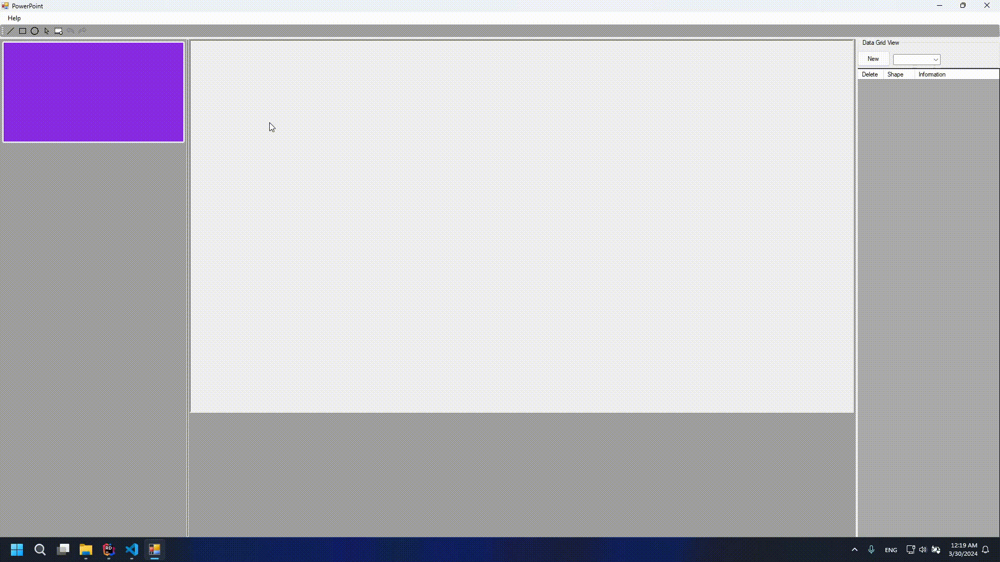

# Power Point

## Description

This is a imitation of power point. Particularly focus on the drawing shapes on the slide.

- Language: C#
- Supported IDE:
    - Visual Studio 2019 Community
    - Visual Studio 2022 Community
    - Jetbrains Rider
- MVC pattern

## How to use

- Clone the repository
- Open the solution file in supported IDE
- Build the solution
- Run the application

## Features

- Create three different types of shapes: Rectangle, Circle, Triangle
    - draw directly on the slide
    - use the buttons to create the shapes
    - 
- Shape actions
    - move
    - resize
    - delete
    - 
- Redo and Undo actions
    - Create and remove slide
    - create and remove shape
    - shape actions
    - 